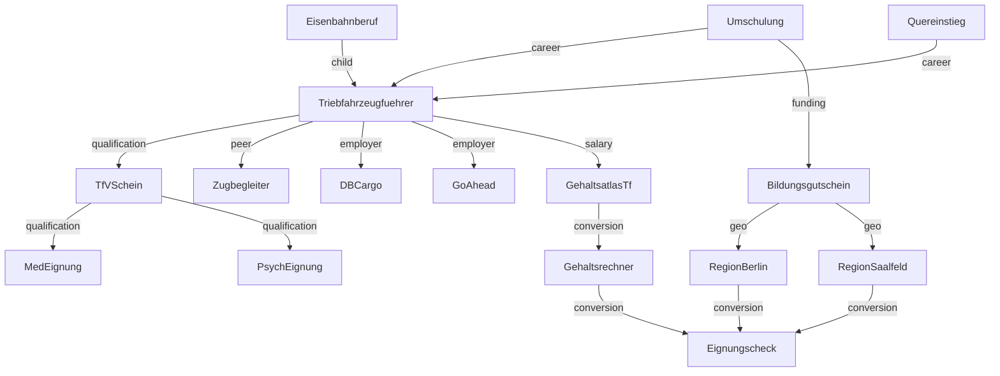
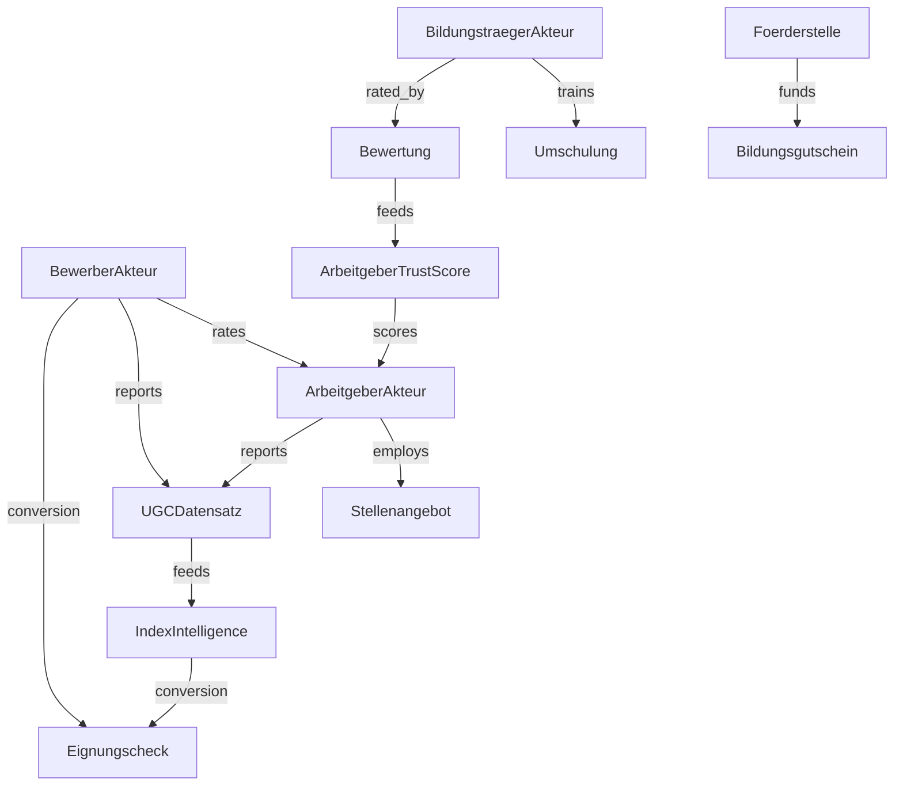

# Kapitel 02 — Entitätsmodell & Knowledge Graph

> Output-Bausteine 4–5. Definiert das Entity-Dominance-Schema und den Branchen-Knowledge-Graph,
> der jede Seite zu einem Knoten in einem zusammenhängenden Wissensnetz macht.

---

## 1. Entity Dominance Engine — Schema pro Entität

Jede Entität wird nach einem einheitlichen, maschinenlesbaren Schema beschrieben. Das Schema ist
gleichzeitig: Content-Briefing, Schema.org-Mapping ([Kapitel 05](05-trust-schema-geo-aeo-llmo.md))
und Knoten-Definition im Graph.

### 1.1 Pflichtfelder je Entität
| Feld | Zweck | Beispiel (Entität "Triebfahrzeugführer") |
|---|---|---|
| `id` / Slug | Stabile Referenz | `triebfahrzeugfuehrer` |
| Definition | Kanonische, belegte Kurzdefinition | "Führt Triebfahrzeuge im Eisenbahnverkehr…" |
| Synonyme | Begriffsvarianten | Lokführer, Lokomotivführer, Tf, Lokfahrer |
| Alternative Begriffe | Umgangssprache/Suchvarianten | "Zugführer" (Abgrenzung!), "Lokomotivführer" |
| Voraussetzungen | Eignung/Qualifikation | Mindestalter, Tauglichkeit, Deutschniveau |
| Karrierewege | Ein-/Aufstieg | Quereinstieg → Umschulung → Tf → Ausbilder |
| Gehälter | Spannen + Quelle | Einstieg/erfahren, Personen-/Güterverkehr |
| Arbeitgeber | Relevante EVU | DB Regio/Cargo, Go-Ahead, Transdev, … |
| Regionen | Geo-Bezug | Bundesländer, Standorte Berlin/Saalfeld |
| Förderungen | Finanzierung | Bildungsgutschein, AVGS, QCG |
| Prüfungen | Nachweise | TfV-Theorie/Praxis, med./psych. Eignung |
| Risiken | Ehrliche Hürden | Schichtdienst, Tauglichkeitsverlust |
| Chancen | Nutzenargumente | Sicherer Bedarf, Quereinstieg möglich |
| Nutzerfragen | Reale Fragen (PAA/LLM) | "Wie lange dauert die Umschulung?" |
| FAQ | Beantwortete Top-Fragen | strukturiert, schema-fähig |
| Conversionpfade | Weg zum Funnel | CTA → `EligibilityWizard` |
| Verwandte Entitäten | Graph-Kanten | Bildungsgutschein, Quereinstieg, Gehaltsatlas |

### 1.2 Entitätstypen (Knotentypen im Graph)
`Beruf` · `Qualifikation` · `Berechtigung` · `Arbeitgeber` · `Region` · `Förderung` ·
`Prüfung` · `Karrierepfad` · `Gehaltsdatensatz` · `Vorschrift` · `Technologie` · `Fahrzeug` ·
`Signalsystem` · `Ausbildungsträger` · `Tool` · `Report/Dataset` · `Person (Experte/Autor)`.

**Akteurs- und Dominanz-Knoten (Erweiterung, [Kapitel 08](08-dominanz-layer-community-netzwerk-infrastruktur.md)):**
`Bewerber (Akteur)` · `Arbeitgeber-Akteur` · `Bildungsträger-Akteur` · `Förderstelle` ·
`Bewertung (Community)` · `Erfahrungsbericht` · `Stellenangebot (JobPosting)` ·
`UGC-Datensatz` · `Index/Intelligence` · `Arbeitgeber-Trust-Score`. Diese Knoten machen den
Graph vom reinen Wissens- zum **Markt-/Akteursgraphen** — Grundlage des zweiseitigen Marktplatzes.

---

## 2. Knowledge Graph Engine

### 2.1 Relationstypen
| Relation | Bedeutung | Beispiel |
|---|---|---|
| `parent` | Oberbegriff | Eisenbahnberuf → Triebfahrzeugführer |
| `child` | Unterbegriff | Triebfahrzeugführer → Güterzug-Lokführer |
| `peer` | Gleichrangig/verwandt | Lokführer ↔ Zugbegleiter |
| `qualification` | benötigt Qualifikation | Lokführer → TfV-Schein |
| `career` | Karrierebeziehung | Quereinstieg → Lokführer |
| `employer` | wird beschäftigt bei | Lokführer → DB Cargo |
| `salary` | Gehaltsbezug | Lokführer → Gehaltsatlas-Datensatz |
| `funding` | förderfähig durch | Umschulung → Bildungsgutschein |
| `geo` | regionaler Bezug | Bildungsgutschein → Region-Hub Berlin |
| `conversion` | führt zu Funnel | Region-Hub → Eignungscheck |
| `rates` | bewertet (Community) | Bewerber-Akteur → Arbeitgeber-Akteur |
| `reports` | meldet Daten (UGC) | Bewerber-Akteur → UGC-Datensatz |
| `employs` | bietet Stellen | Arbeitgeber-Akteur → Stellenangebot |
| `trains` | bildet aus | Bildungsträger-Akteur → Umschulung |
| `funds` | fördert | Förderstelle → Bildungsgutschein |
| `feeds` | speist Datensatz/Index | UGC-Datensatz → Index/Intelligence |
| `scores` | bewertet Dominanz | Entity Ownership Score → Entität |

### 2.2 Graph-Ausschnitt (Kern)

### 2.2b Markt-/Akteursgraph (Erweiterung)

Über dem Wissensgraphen liegt der Akteursgraph, der die vier Marktseiten verbindet und so den
zweiseitigen Marktplatz und die Netzwerkeffekte aus [Kapitel 08](08-dominanz-layer-community-netzwerk-infrastruktur.md) abbildet.

### 2.3 Verbindlichkeit
- **Jede Seite ist ein Knoten** mit mindestens drei ausgehenden und einer eingehenden Kante.
- Interne Verlinkung folgt dem Graphen, nicht dem Bauchgefühl: Links werden aus den Kanten
  generiert, sodass Crawler und LLMs die Beziehungsstruktur zuverlässig rekonstruieren.
- Der Graph ist die **Single Source of Truth** für Navigation, Breadcrumbs, "Verwandte Themen",
  und das `about`/`mentions`-Schema-Markup.

### 2.4 Andocken an reale Domänenobjekte
Der Graph übernimmt bestehende Enums als Knoten/Facetten, statt parallele Begriffe zu erfinden:
- `PreferredLocation` (Berlin/Saalfeld) → `Region`-Knoten mit `conversion`-Kante zum Funnel
- `FunnelPath` (employed/unemployed) → Facette an `Förderung`-Knoten (unterschiedliche Förderwege)
- `LeadStatus`-Pipeline → liefert (anonymisiert) Prozessdaten für `Report/Dataset`-Knoten
- `DocumentType`-Bundle → speist `Prüfung`/`Förderung`-Knoten (welche Unterlagen die AA erwartet)

Referenz: [src/features/fairtrain-funnel/types.ts](../../src/features/fairtrain-funnel/types.ts).

### 2.5 Entity Ownership Score als Graph-Attribut
Jeder Wissensknoten trägt einen **Entity Ownership Score (EOS)** als Attribut (Definition in
[Kapitel 08, §5](08-dominanz-layer-community-netzwerk-infrastruktur.md#5-entity-ownership-score-engine)).
Der Graph wird damit nicht nur Navigations-, sondern **Steuerungsstruktur**: Knoten mit niedrigem
EOS und hohem Markt-/Conversion-Wert werden priorisiert ausgebaut; die schwächste EOS-Dimension je
Knoten bestimmt die konkrete Maßnahme (Content/Daten/Tool/Trust/Conversion/Retrieval).

---

## 3. Umsetzung (PHASE 1–4)

**PHASE 1 (Monat 0–3)**
- Entitätsschema + Relationstypen als JSON/Schema festschreiben (eine Quelle, später als
  Datendatei im Repo, die Seiten generiert).
- Top-50 Knoten + Kanten modellieren (Kern-Berufe, Förderung, Standorte, Gehalt).

**PHASE 2 (Monat 3–9)**
- Ausbau auf Top-300 Knoten (Arbeitgeber, Regionen, Qualifikationen, Prüfungen).
- Automatisierte interne Verlinkung aus dem Graphen.

**PHASE 3 (Monat 9–18)**
- Entity-Linking nach Wikidata/GND; konsistente `sameAs`-Auszeichnung.
- Graph-getriebene "related entities"-Module auf allen Hubs.

**PHASE 4 (Monat 18–36)**
- Öffentliches, navigierbares Graph-/Wissensportal (Teil der Plattform-Verdichtung,
  siehe [Kapitel 07](07-prioritaeten-roi-roadmaps.md)).
