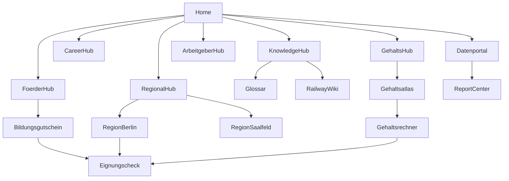

# Kapitel 03 — Informationsarchitektur, URL-Architektur, Content-Architektur

> Output-Bausteine 6–8. Übersetzt Marktmodell und Knowledge Graph in eine navigierbare
> Struktur: Hubs, URL-Konventionen, Seitentypen und die Information-Gain-Pflicht je Seite.

---

## 1. Informationsarchitektur — das Hub-Modell

Die Plattform besteht aus **Hubs** (thematische Zentren) und **Spokes** (Detailseiten). Jeder Hub
hat eine Pillar Page, einen Topic Cluster und definierte Conversion-Übergänge zum bestehenden Funnel.

| Hub-Typ | Aufgabe | Beispiel-Pillar | Conversion-Ziel |
|---|---|---|---|
| Knowledge Hub / Wiki | Faktenwissen, Definitionen | "Lokführer werden: der komplette Leitfaden" | weicher CTA → Eignungscheck |
| Glossar | Begriffsdominanz, LLM-Snippets | "PZB", "LZB", "ETCS", "TfV" | interne Vernetzung |
| Career Hub | Wege in den Beruf | "Quereinstieg Lokführer" | Karriereplaner → Eignungscheck |
| Förder Hub | Finanzierung | "Bildungsgutschein für die Lokführer-Umschulung" | Fördercheck → `EligibilityWizard` |
| Gehalts Hub | Gehaltswissen + Tool | "Lokführer Gehalt" | Gehaltsrechner → Eignungscheck |
| Prüfungs Hub | Eignung & Prüfungen | "Medizinische & psychologische Eignung" | Eignungstest → Eignungscheck |
| Arbeitgeber Hub | EVU-Profile/Vergleich | "Arbeitgeber im Bahnverkehr" | Arbeitgebermatcher |
| Regional Hub | Geo-Einstieg | "Lokführer-Umschulung in Berlin/Saalfeld/<Land>" | lokaler CTA → Eignungscheck |
| Conversion Hub | Transaktionsnahe Seiten | "Jetzt Eignung prüfen" | direkte Funnel-Übergabe |
| Datenportal | Eigene Datensätze | "Gehaltsatlas", "Arbeitsmarktindex" | Citation + Soft-CTA |
| Report Center | Studien/Reports | "Bahn Recruiting Report 2026" | PR + Lead-Magnet |

### 1.1 Hub-Hierarchie (Überblick)

---

## 2. URL-Architektur

### 2.1 Prinzipien
- **Eine URL, eine Aufgabe.** Keine URL bedient zwei Intents.
- Sprechende, kurze, deutsche Slugs; flache Tiefe; keine Parameter-URLs für Inhalte.
- Stabilität: Slugs ändern sich nicht ohne 301; Slug-Quelle ist der Graph-`id` aus
  [Kapitel 02](02-entitaeten-knowledge-graph.md).
- Bestehende Funnel-Routen (`/`, `/eligibility`, `/bewerbung/[token]`) bleiben unverändert und
  werden zu Conversion-Endpunkten der Hubs.

### 2.2 Konventionen je Hub-Typ
| Muster | Hub-Typ | Beispiel |
|---|---|---|
| `/bahnberufe/<beruf>` | Knowledge/Beruf | `/bahnberufe/triebfahrzeugfuehrer` |
| `/wiki/<thema>` | Railway Wiki | `/wiki/etcs` |
| `/glossar/<begriff>` | Glossar | `/glossar/pzb` |
| `/karriere/<pfad>` | Career | `/karriere/quereinstieg-lokfuehrer` |
| `/foerderung/<programm>` | Förder | `/foerderung/bildungsgutschein` |
| `/gehalt/<beruf>` | Gehalt | `/gehalt/lokfuehrer` |
| `/pruefung/<thema>` | Prüfung | `/pruefung/medizinische-eignung` |
| `/arbeitgeber/<evu>` | Arbeitgeber | `/arbeitgeber/db-cargo` |
| `/regionen/<bundesland>/<thema>` | Regional | `/regionen/berlin/lokfuehrer-umschulung` |
| `/daten/<dataset>` | Datenportal | `/daten/gehaltsatlas` |
| `/reports/<report>` | Report Center | `/reports/bahn-recruiting-report-2026` |
| `/tools/<tool>` | Tools | `/tools/foerdercheck` |

### 2.3 Programmatische Muster (nur bei echtem Mehrwert)
Programmatische Seiten (Regionen × Beruf, Arbeitgeber × Region) werden **nur** erzeugt, wenn pro
Seite eigene Daten/Information Gain vorliegen (lokale Anbieter, regionale Gehälter, lokale
Bedarfszahlen). Andernfalls Konsolidierung auf den übergeordneten Hub, um Thin Content zu vermeiden.

---

## 3. Content-Architektur

### 3.1 Seitentypen & Pflichtbausteine
| Seitentyp | Pflichtbausteine | Information-Gain-Quelle |
|---|---|---|
| Pillar | Definition, Struktur, Verlinkung in Cluster, FAQ, CTA | Vollständigkeit + eigene Übersicht/Tabelle |
| Wiki/Glossar | Kanon-Definition, Synonyme, `sameAs`, verwandte Begriffe | präzise, belegte, snippet-fähige Fakten |
| Daten-/Atlas-Seite | Methodik, Tabelle, Visualisierung, Stand, Download | **eigene Daten** (exklusiv) |
| Vergleich/Ranking | Kriterien, Tabelle, Bewertungslogik | eigene strukturierte Gegenüberstellung |
| Career-/Förder-Guide | Schritt-für-Schritt, Voraussetzungen, Tool-Einstieg | Prozesswissen + Tool |
| Regional | lokale Anbieter/Gehälter/Bedarf, Standortbezug | lokale Exklusivdaten |
| Tool-Seite | Eingabe, Ergebnis, Erklärung, Datenwert | interaktiver Nutzwert |

### 3.2 Information-Gain-Regel (verbindlich)
Vor Veröffentlichung jeder Seite wird beantwortet:

> **Welche Information erhält der Nutzer ausschließlich hier?**

Zulässige Gain-Quellen: neue Daten, neue Vergleiche, neue Tabellen, neue Visualisierungen, neue
Modelle, neue Zusammenhänge. **Nicht zulässig:** Umformulierung von Bestandswissen. Besteht die
Seite den Test nicht, wird sie nicht gebaut (Konsolidierung statt Dünninhalt).

### 3.3 Technische Umsetzung im bestehenden Stack
- Content-Quelle: strukturierte Daten (MDX/JSON) im Repo, aus dem Graph generiert — passt zum
  Next.js-App-Router-Setup; Seiten als Server Components mit statischer Generierung wo möglich.
- Schema-Injektion analog zum bestehenden FAQ-JSON-LD in [src/app/page.tsx](../../src/app/page.tsx).
- Conversion-Übergänge nutzen die bestehenden Funnel-Routen, keine Parallelstruktur.

---

## 4. Umsetzung (PHASE 1–4)

**PHASE 1 (Monat 0–3)**
- IA-Skelett + URL-Konventionen fixieren; Knowledge Hub + Glossar als erste Hubs.
- 30–50 Kern-Wiki/Glossar-Seiten mit nachgewiesenem Information Gain.

**PHASE 2 (Monat 3–9)**
- Förder-, Gehalts-, Career-Hub; erste Regional-Hubs (Berlin/Saalfeld als Anker).
- Programmatische Regional-Seiten nur mit lokalem Datenmehrwert.

**PHASE 3 (Monat 9–18)**
- Arbeitgeber-Hub + Datenportal-Seiten; vollständige Cluster-Vernetzung aus dem Graphen.

**PHASE 4 (Monat 18–36)**
- Report Center + öffentliches Wissensportal; IA als Plattform-Navigation institutionalisieren.
