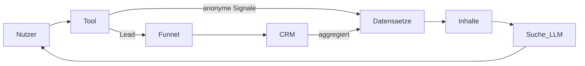

# Kapitel 04 — Datenstrategie (Data Monopoly) & Toolstrategie (Career OS)

> Output-Bausteine 9–10. Die verteidigbarste Schicht der Infrastruktur: eigene Datensätze, die
> niemand sonst strukturiert bereitstellt, und Werkzeuge, die Nutzwert in Daten + Conversion verwandeln.

---

## 1. Data Monopoly Engine

### 1.1 Leitidee
Inhalte sind kopierbar, **kontinuierlich gepflegte Primärdaten nicht**. Lokführerzentrum besitzt
durch CRM und Funnel eine seltene Quelle anonymisierbarer Prozess- und Marktdaten. Daraus
entstehen Datensätze mit hohem Citation-, PR- und Retrieval-Potenzial.

### 1.2 Datensatz-Portfolio
Jeder Datensatz wird nach einheitlichem Steckbrief geführt.

| Datensatz | Kerninhalt | Primärquelle | Update | Citation/PR | Data-Ownership |
|---|---|---|---|---|---|
| Lokführer Gehaltsatlas Deutschland | Gehälter nach Region/Erfahrung/Verkehrsart/Arbeitgeber | Stellen, Tarifwerke, eigene Erhebung, CRM-Signale | jährlich + Quartalsdelta | sehr hoch | hoch |
| Bahn Arbeitgeberatlas | EVU-Profile: Standorte, Verkehr, Einstieg, Bewertungskriterien | öffentl. Register, EVU-Angaben, Recherche | halbjährlich | hoch | mittel-hoch |
| Bildungsgutscheinatlas | Förderwege, Anspruch, regionale Praxis, Erfolgsfaktoren | SGB-Recht, AA/Jobcenter-Praxis, anonym. CRM-Prozessdaten | jährlich | hoch | sehr hoch |
| Umschulungsatlas | Anbieter, Dauer, Inhalte, Förderfähigkeit (AZAV) | Anbieter, Kursnet, eigene Bewertung | halbjährlich | mittel | mittel |
| Bahnarbeitsmarktindex | Bedarf/offene Stellen/Trend nach Region & Verkehr | Stellenmarkt-Aggregation, eigene Reihe | monatlich | sehr hoch | hoch |
| Fachkräftemangelindex Bahn | Engpass-Score nach Beruf/Region | Index aus Stellen-/Demografiedaten | quartalsweise | sehr hoch | hoch |
| Karriereindex | Quereinstiegs-/Aufstiegschancen-Score | eigene Methodik aus Markt-/CRM-Daten | quartalsweise | mittel-hoch | hoch |
| Ausbildungsindex | Verfügbarkeit/Qualität von Ausbildungs-/Umschulungsplätzen | Anbieter-/Marktdaten | halbjährlich | mittel | mittel |
| Prüfungsindex | Anforderungen/Quoten/Stolpersteine | Regelwerk + anonym. Prozessdaten | jährlich | mittel-hoch | hoch |
| Arbeitgeberranking | gewichtetes Ranking nach transparenten Kriterien | Arbeitgeberatlas + Gehaltsatlas | jährlich | sehr hoch | hoch |
| Bahn Recruiting Report | Recruiting-Trends, Time-to-Hire, Förderquoten | anonym. CRM-Prozessmetriken | jährlich | sehr hoch | sehr hoch |
| Eisenbahn Branchenreport | Gesamtschau aller Indizes | Aggregation | jährlich | sehr hoch | hoch |

### 1.3 Datensatz-Steckbrief (verbindliche Felder)
Für **jeden** Datensatz dokumentiert: Quelle · Methodik · Datenerhebung · Validierung ·
Aktualisierung · Visualisierung · API-Potenzial · PR-Potenzial · Citation-Potenzial · Monetarisierung.

Beispiel — **Lokführer Gehaltsatlas**:
- **Quelle:** Stellenanzeigen-Aggregation, Tarifverträge (EVG/GDL), eigene Erhebung, anonymisierte
  CRM-Signale (z. B. Zielgehalt/Region aus Funnel-Eingaben).
- **Methodik:** Median + Spanne je Segment (Region × Erfahrung × Verkehrsart × Arbeitgebertyp),
  Mindeststichprobe je Segment, Ausreißerbereinigung, transparente Gewichtung.
- **Erhebung:** kontinuierlich; Quartals-Snapshot eingefroren und versioniert.
- **Validierung:** Plausibilitätschecks gegen Tarifbänder; Review durch Branchen-Experten
  ([Kapitel 05](05-trust-schema-geo-aeo-llmo.md)); dokumentierte Stichprobengrößen.
- **Aktualisierung:** jährliche Hauptausgabe + Quartalsdelta; Änderungslog je Segment.
- **Visualisierung:** Karte (Bundesland-Heatmap), Tabellen, Vergleichsbalken.
- **API-Potenzial:** read-only Dataset-Endpoint (`/daten/gehaltsatlas`) mit `Dataset`-Schema.
- **PR-/Citation-Potenzial:** jährliche Pressemeldung "Lokführer-Gehalt 2026", LLM-zitierfähige Fakten.
- **Monetarisierung:** Lead-Magnet (Report-Download), perspektivisch Daten-Lizenz/B2B.

### 1.4 Compliance & Datenschutz
- Nur **aggregierte, anonymisierte** Prozessdaten verlassen das CRM (k-Anonymität je Segment).
- Keine personenbezogenen Funnel-Daten in öffentlichen Datensätzen.
- Datenschutzbasis dokumentiert; Förderdaten ohne Garantie-Aussagen (konsistent mit Funnel-FAQ).

### 1.5 Zweite Datenquelle: User Generated Data (Crowdsourcing)
Neben Recherche und CRM-Prozessdaten ist die **User Generated Data Engine**
([Kapitel 08, §2](08-dominanz-layer-community-netzwerk-infrastruktur.md#2-user-generated-data-engine))
die skalierende Quelle des Datenmonopols. Gehaltsmeldungen, Arbeitgeberdaten, Schichtmodelle,
Bewerbungs- und Umschulungs-Erfolgsquoten fließen über eine
**Erfassung → Validierung → QS → Aggregation**-Pipeline in dieselben Datensätze (Gehaltsatlas,
Arbeitgeberatlas, Umschulungsatlas, Recruiting Report). Wirkung auf die Steckbrief-Dimensionen:

| Datensatz | UGC-Beitrag | Effekt auf Data-Ownership |
|---|---|---|
| Gehaltsatlas | Gehaltsmeldungen | Granularität/Aktualität ↑ → schwerer kopierbar |
| Arbeitgeberatlas | Arbeitgeberdaten, Schichtmodelle | Exklusivität ↑ |
| Umschulungsatlas | Erfolgsquoten je Anbieter | einzigartige Outcome-Daten |
| Recruiting Report | Bewerbungsquoten | proprietäre Funnel-Outcome-Reihe |

Qualitätssicherung (Mindeststichprobe, Ausreißerbereinigung, Verifizierung, Reviewer für sensible
Werte) ist verbindlich; methodische Details siehe [Kapitel 08, §2.3](08-dominanz-layer-community-netzwerk-infrastruktur.md#23-pipeline-erfassung--validierung--qs--datensatz).

### 1.6 Industry Intelligence als Veredelung
Die Indizes (Arbeitsmarkt-, Gehalts-, Fachkräftemangel-, Arbeitgeber-, Regionalindex) werden in der
**Industry Intelligence Engine** ([Kapitel 08, §4](08-dominanz-layer-community-netzwerk-infrastruktur.md#4-industry-intelligence-engine))
zu einem kontinuierlich publizierenden Layer mit festem Studien-/Medienkalender gebündelt — die
Citation-/PR-Maschine, die Rohdaten in wiederkehrende Berichterstattung verwandelt.

---

## 2. Career Operating System — Toolstrategie

### 2.1 Leitidee
Jedes Tool muss gleichzeitig fünf Werte erzeugen: **Nutzwert, Datenwert, Vertrauensgewinn,
Conversionwert, Suchwert.** Tools docken an den bestehenden Motor an —
`EligibilityWizard` (`/eligibility`), CRM-Pipeline, WhatsApp — statt Parallelflüsse zu bauen.

### 2.2 Tool-Portfolio
| Tool | Nutzwert | Datenwert | Conversion-Andockung |
|---|---|---|---|
| Karrierecheck | Passende Bahnberufe je Profil | Profil-/Intent-Daten | → Eignungscheck |
| Fördercheck | Welche Förderung realistisch ist | Förderweg-Verteilung (employed/unemployed) | → `EligibilityWizard` + WhatsApp-Nurture |
| Bildungsgutschein-Check | Anspruchs-Indikation + nächste Schritte | BG-Eignungssignale | → Funnel + CRM-Lead |
| Gehaltsrechner | Erwartbares Gehalt nach Segment | speist/validiert Gehaltsatlas | → Eignungscheck (Soft-CTA) |
| Arbeitgebermatcher | Passende EVU nach Region/Präferenz | Arbeitgeber-Präferenzdaten | → Arbeitgeberatlas + Funnel |
| Umschulungsfinder | Passende Maßnahme/Anbieter | Anbieter-Nachfragedaten | → Funnel |
| Ausbildungsfinder | Passende Ausbildungswege | Nachfragedaten | → Funnel |
| Karriereplaner | Schritt-für-Schritt-Pfad zum Tf | Pfad-/Drop-off-Daten | → Eignungscheck |
| Bewerbungsassistent | Unterlagen/AA-Mappe vorbereiten | Dokumentenbedarf (`DocumentType`) | → Bewerberportal |
| Eignungstest (Self-Assessment) | Indikation med./psych. Eignung | Eignungs-Signale | → Eignungscheck |

### 2.3 Datenrückfluss-Schleife
Tools erzeugen anonymisierte Eingaben, die die Datensätze (Abschnitt 1) speisen und schärfen —
ein sich selbst verstärkender Kreislauf:

### 2.4 Andockpunkte im Code (bestehend)
- Conversion-Endpoint: `/eligibility` (`EligibilityWizard`) und `/` (`FairtrainLandingPage`).
- Lead-/Prozessdaten: CRM-Pipeline (`LeadStatus`), Dokumentenbedarf (`DocumentType`),
  Förderpfad (`FunnelPath`), Standort (`PreferredLocation`) — siehe
  [src/features/fairtrain-funnel/types.ts](../../src/features/fairtrain-funnel/types.ts).
- Nurturing: WhatsApp Business Cloud API (vorbereitet) für Tool-Follow-ups.

---

## 3. Umsetzung (PHASE 1–4)

**PHASE 1 (Monat 0–3)**
- Gehaltsatlas v1 (Datensatz + `/daten/gehaltsatlas`) und Gehaltsrechner als erster Tool-Wedge.
- Fördercheck/BG-Check als direkte Erweiterung des bestehenden Eignungslogik-Funnels.

**PHASE 2 (Monat 3–9)**
- Arbeitgeberatlas + Arbeitgebermatcher; Bahnarbeitsmarktindex (monatliche Reihe startet).
- Datenrückfluss-Schleife produktiv (Tool-Signale → Datensätze).

**PHASE 3 (Monat 9–18)**
- Fachkräftemangel-/Karriere-/Prüfungsindex; Karriereplaner + Bewerbungsassistent.
- Erste Dataset-APIs read-only veröffentlichen.

**PHASE 4 (Monat 18–36)**
- Bahn Recruiting Report + Branchenreport als jährliche Flaggschiffe; Daten-Lizenzierung/B2B prüfen.
