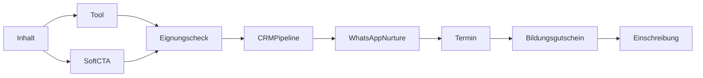

# Kapitel 06 — Conversionstrategie & Digital-PR-Strategie

> Output-Bausteine 16–17. Verbindet Reichweite und Autorität mit dem bestehenden Conversion-Motor
> und erzeugt zitierfähige PR-Assets, die Autorität und Backlinks zurückspeisen.

---

## 1. Conversionstrategie

### 1.1 Grundsatz
Reichweite ohne Conversion ist Eitelkeit. Jede Wissens-, Daten- und Tool-Seite hat einen
definierten, **kontextangemessenen** Übergang in den bestehenden Funnel — nie aufdringlich,
immer passend zur Intent-Stufe.

### 1.2 Conversion-Endpunkte (bestehend, unverändert)
- Primär: Eignungscheck `/eligibility` (`EligibilityWizard`) → erzeugt Lead in CRM-Pipeline.
- Landing/Funnel: `/` (`FairtrainLandingPage`).
- Nach Conversion: Bewerberportal `/bewerbung/[token]` (Upload/AA-Mappe).
- Nurturing: WhatsApp Business Cloud API (vorbereitet) + CRM-Automationen/Templates.

### 1.3 Intent-gerechte Conversion-Leiter
| Intent-Stufe | Seitentyp | Conversion-Angebot | Härte |
|---|---|---|---|
| Informational | Wiki/Glossar | "Verwandte Themen" + weicher Hinweis auf Eignungscheck | weich |
| Research/Daten | Gehaltsatlas/Index | Report-Download (Lead-Magnet) + Gehaltsrechner | weich-mittel |
| Career | Career-Hub/Karriereplaner | "Deinen Weg prüfen" → Eignungscheck | mittel |
| Commercial | Vergleich/Umschulungsfinder | "Passende geförderte Umschulung finden" | mittel-hart |
| Transactional | Förder-/Conversion-Hub | direkter Start `EligibilityWizard` | hart |
| Local | Regional-Hub | lokaler CTA (Berlin/Saalfeld) → Eignungscheck | mittel-hart |

### 1.4 Conversion-Mechanik
- **Tools als Conversion-Brücke:** Fördercheck/Gehaltsrechner liefern Nutzwert und übergeben
  qualifizierte Signale an den Funnel (siehe [Kapitel 04](04-daten-und-tools.md)).
- **Micro-Conversions:** Report-Download, WhatsApp-Opt-in, Tool-Ergebnis per E-Mail — alle als
  CRM-Leads mit Quelle/Intent getrackt (nutzt bestehendes `LeadSource`/Pipeline-Modell).
- **Kein Bruch im Datenfluss:** Alle Übergänge landen in der bekannten `LeadStatus`-Pipeline,
  keine Parallel-Systeme — siehe [src/features/fairtrain-funnel/types.ts](../../src/features/fairtrain-funnel/types.ts).
- **Messung:** Conversion-Qualität (nicht nur Menge) — Anteil qualifizierter Leads je Hub/Tool,
  Förderquote, Time-to-Appointment aus dem CRM.

### 1.5 Conversion-Fluss

### 1.6 Zweiseitiger Marktplatz & Netzwerkeffekt-Conversion

Mit der Employer-Plattform ([Kapitel 08, §3](08-dominanz-layer-community-netzwerk-infrastruktur.md#3-employer-platform-engine))
entsteht eine **zweite Conversion-Seite**: Arbeitgeber konvertieren in Portal-Accounts, Stellen-
Listings und Analytics-/Recruiting-Abos. Beide Seiten verstärken sich.

| Marktseite | Conversion-Ereignis | Erzeugter Datenwert |
|---|---|---|
| Bewerber | Eignungscheck, Tool-Nutzung, Bewertung, Datenmeldung | Intent-/Erfolgs-/Erfahrungsdaten |
| Arbeitgeber | Portal-Registrierung, Stelle, Analytics-Abo | Markt-/Bedarfs-/Konditionsdaten |

**Netzwerkeffekt-Conversion-Regel:** Jede Conversion soll zusätzlich Datenwert erzeugen, der die
Plattform für die jeweils andere Seite attraktiver macht (mehr Bewerberdaten → wertvolleres
Arbeitgeber-Analytics → mehr Arbeitgeber → mehr Stellen → höherer Bewerberwert). Die
selbstverstärkende Schleife ist in [Kapitel 08, §6](08-dominanz-layer-community-netzwerk-infrastruktur.md#6-network-effect-engine) definiert.

Micro-Conversions der Community/UGC (Bewertung abgeben, Gehalt melden) zählen als vollwertige
Conversions, weil sie den Daten-Burggraben vertiefen — auch ohne unmittelbaren Funnel-Eintritt.

---

## 2. Digital-PR-Strategie

### 2.1 Grundsatz
PR-Assets werden **aus dem Datenmonopol** generiert ([Kapitel 04](04-daten-und-tools.md)). Eigene,
datierte, methodisch belegte Zahlen sind das, was Redaktionen zitieren und LLMs als Quelle nennen.

### 2.2 Asset-Portfolio & Bewertung
| PR-Asset | Aufhänger | Medienpotenzial | Citation | Backlink | Retrieval |
|---|---|---|---|---|---|
| Lokführer-Gehaltsstudie (jährlich) | "Was Lokführer 2026 verdienen" | sehr hoch | sehr hoch | hoch | sehr hoch |
| Bahn-Arbeitsmarktstudie | Bedarf/offene Stellen/Trend | sehr hoch | hoch | hoch | hoch |
| Fachkräftemangel-Report Bahn | Engpass nach Region/Beruf | sehr hoch | sehr hoch | hoch | sehr hoch |
| Arbeitgeberranking Bahn | "Beste Bahn-Arbeitgeber" | hoch | hoch | sehr hoch | mittel-hoch |
| Förder-/Bildungsgutschein-Report | Förderquoten/Praxis | mittel-hoch | hoch | mittel | hoch |
| Branchen-/Trendreport (jährlich) | Gesamtschau | hoch | hoch | hoch | hoch |
| Quereinstiegs-/Umschulungs-Report | Wege in den Beruf | mittel | mittel-hoch | mittel | mittel-hoch |

### 2.3 Bewertungsdimensionen je Asset (verbindlich)
Medienpotenzial · Citation-Potenzial · Autoritätsgewinn · Backlink-Potenzial · Retrieval-Potenzial.
Nur Assets mit mindestens "hoch" in zwei dieser Dimensionen werden zu Flaggschiff-Studien ausgebaut;
die übrigen laufen als wiederkehrende Datenupdates.

### 2.4 Distribution
- Pressemitteilung + Daten-Landingpage (`/reports/<report>`) mit `Dataset`/`Article`-Schema.
- Eingebettete, einbettbare Visualisierungen (Backlink-Anreiz durch Einbettcode mit Quelle).
- Outreach an Fach-/Regionalmedien und Branchendienste; jährlicher Studienrhythmus für
  wiederkehrende Berichterstattung.
- Verzahnung mit dem Report Center (Plattformbaustein, [Kapitel 07](07-prioritaeten-roi-roadmaps.md)).

---

## 3. Umsetzung (PHASE 1–4)

**PHASE 1 (Monat 0–3)**
- Conversion-Leiter je Seitentyp definieren; Gehaltsrechner + Fördercheck als Conversion-Brücken live.
- Erste datierte Gehalts-Datenbasis als PR-Grundlage aufbauen.

**PHASE 2 (Monat 3–9)**
- Erste Flaggschiff-Studie (Lokführer-Gehaltsstudie) veröffentlichen + Outreach.
- Conversion-Tracking je Hub/Tool im CRM (Qualität, nicht nur Menge).

**PHASE 3 (Monat 9–18)**
- Studienkalender (Gehalt jährlich, Arbeitsmarkt monatlich, Fachkräftemangel quartalsweise).
- Backlink-/Citation-Monitoring; einbettbare Visualisierungen flächig.

**PHASE 4 (Monat 18–36)**
- Report Center als wiederkehrende Medien-Referenz; Lokführerzentrum wird Standard-Zitatquelle
  für Bahn-Arbeitsmarktdaten im deutschsprachigen Raum.
