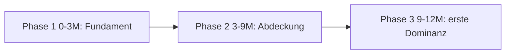
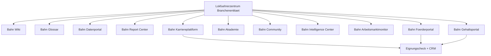

# Kapitel 07 — Prioritätenmatrix, Ressourcenbedarf, ROI & Roadmaps

> Output-Bausteine 18–23. Übersetzt die Strategie in eine priorisierte, ressourcenbewertete
> Umsetzungssequenz mit 12-, 24- und 36-Monats-Roadmap.

---

## 1. Prioritätenmatrix

Bewertung nach dem Scoring-Modell aus dem [README](README.md#4-scoring-modell-execution-engine)
(1–5 je Dimension; Priority Score gewichtet). Höher = früher umsetzen.

| Initiative | Impact | Data-Own. | Authority | Citation | TTV | Lead | Effort* | Priority |
|---|:--:|:--:|:--:|:--:|:--:|:--:|:--:|:--:|
| Knowledge/Glossar-Hub (Top-50) | 5 | 3 | 5 | 4 | 4 | 3 | niedrig | **sehr hoch** |
| Gehaltsatlas v1 + Gehaltsrechner | 5 | 5 | 4 | 5 | 3 | 4 | mittel | **sehr hoch** |
| Fördercheck / BG-Check (Funnel-nah) | 4 | 4 | 3 | 3 | 4 | 5 | niedrig | **hoch** |
| Trust-/Schema-Fundament | 4 | 2 | 5 | 4 | 4 | 2 | niedrig | **hoch** |
| Förder-/Career-/Gehalts-Hub | 4 | 3 | 4 | 4 | 3 | 4 | mittel | **hoch** |
| Regional-Hubs (Berlin/Saalfeld + Top-Länder) | 4 | 3 | 3 | 3 | 3 | 5 | mittel | **hoch** |
| Bahnarbeitsmarktindex (monatlich) | 4 | 4 | 4 | 5 | 2 | 2 | mittel | **mittel-hoch** |
| Arbeitgeberatlas + Matcher | 4 | 4 | 4 | 4 | 2 | 4 | hoch | **mittel-hoch** |
| Flaggschiff-Gehaltsstudie (PR) | 5 | 5 | 5 | 5 | 2 | 3 | hoch | **mittel-hoch** |
| Fachkräftemangel-/Karriere-/Prüfungsindex | 4 | 4 | 4 | 5 | 2 | 2 | hoch | **mittel** |
| Karriereplaner / Bewerbungsassistent | 3 | 3 | 3 | 2 | 3 | 4 | mittel | **mittel** |
| Dataset-APIs (read-only) | 3 | 5 | 4 | 4 | 2 | 1 | mittel | **mittel** |
| Report Center / Akademie / Community | 4 | 4 | 5 | 4 | 1 | 3 | sehr hoch | **langfristig** |

\* Effort wirkt als Abwertung/Tiebreaker (hoher Aufwand verschiebt nach hinten).

### 1.2 Dominanz-Layer in der Prioritätenmatrix (Moat/Netzwerkeffekt-Gewichtung)

Für die Layer aus [Kapitel 08](08-dominanz-layer-community-netzwerk-infrastruktur.md) wird zusätzlich
nach **Moat** und **Network Effect** gewichtet (siehe [README-Scoring](README.md#4-scoring-modell-execution-engine)).
Dadurch ranken selbstverstärkende, schwer kopierbare Layer trotz höherem Aufwand vorn.

| Dominanz-Layer | Impact | Moat | NetEffect | Data-Own. | Citation | Effort* | Priority |
|---|:--:|:--:|:--:|:--:|:--:|:--:|:--:|
| Entity Ownership Score Engine | 4 | 4 | 2 | 3 | 3 | niedrig | **sehr hoch** (Steuerung zuerst) |
| UGC-Data-Engine (Gehaltsmeldungen zuerst) | 5 | 5 | 5 | 5 | 5 | mittel | **sehr hoch** |
| Community Engine (Bewertungen/Berichte) | 4 | 5 | 5 | 4 | 4 | mittel | **hoch** |
| Industry Intelligence Engine (Indizes/Reports) | 5 | 4 | 3 | 4 | 5 | mittel-hoch | **hoch** |
| Network Effect Engine (Designprinzip) | 5 | 5 | 5 | 4 | 3 | laufend | **hoch** (querschnittlich) |
| Employer Platform Engine | 5 | 5 | 5 | 4 | 3 | sehr hoch | **mittel-hoch** (nach Liquidität der Bewerberseite) |
| Industry Infrastructure (Zielzustand) | 5 | 5 | 5 | 5 | 4 | sehr hoch | **langfristig** |

\* Reihenfolge-Logik: Erst **Messsystem** (EOS) und **datengenerierende** Layer (UGC, Community),
die sofort den Burggraben vertiefen und bestehende Datensätze schärfen; die **Employer-Plattform**
folgt, sobald die Bewerberseite genug Liquidität/Datenwert hat, um Arbeitgeber anzuziehen
(klassische Zweiseitigkeits-Reihenfolge: erst eine Seite verdichten, dann die zweite andocken).

### 1.1 Empfohlener erster Keil (Begründung)
**Knowledge-/Glossar-Hub + Gehaltsatlas/Gehaltsrechner.** Begründung:
- **Höchste kombinierte Wirkung:** Der Knowledge-Hub verankert Entität + Autorität (hoher
  Authority/TTV bei niedrigem Aufwand); der Gehaltsatlas liefert das Datenmonopol mit höchster
  Citation- und Retrieval-Wirkung.
- **Sofortige Conversion-Kopplung:** Beide docken direkt an `EligibilityWizard`/CRM an, erzeugen
  also nicht nur Reichweite, sondern qualifizierte Leads.
- **Verteidigbarkeit:** Daten + kontinuierliche Pflege sind schwer kopierbar; reine Content-Konkurrenz
  kann nicht nachziehen.

---

## 2. Ressourcenbedarf

Rollen-/Kapazitätsschätzung je Phase (FTE = Vollzeitäquivalent, Richtwert).

| Rolle | Phase 1 (0–3 M) | Phase 2 (3–9 M) | Phase 3 (9–18 M) | Phase 4 (18–36 M) |
|---|:--:|:--:|:--:|:--:|
| Information/SEO-Architekt | 0,5 | 0,5 | 0,3 | 0,2 |
| Fach-Redaktion Bahn (+ Reviewer) | 1,0 | 1,5 | 1,5 | 1,0 |
| Data/Analytics Engineer | 0,5 | 1,0 | 1,0 | 0,8 |
| Frontend/Next.js Engineer | 0,5 | 1,0 | 1,0 | 1,0 |
| Tooling/Backend Engineer | 0,3 | 0,8 | 1,0 | 0,8 |
| Digital PR / Outreach | 0,2 | 0,5 | 0,8 | 0,8 |
| Produkt/Strategie (Steuerung) | 0,3 | 0,3 | 0,3 | 0,3 |
| **Summe Basis (≈ FTE)** | **3,3** | **5,6** | **5,9** | **4,9** |

#### Zusatzbedarf für Dominanz-Layer ([Kapitel 08](08-dominanz-layer-community-netzwerk-infrastruktur.md))
| Rolle | Phase 1 | Phase 2 | Phase 3 | Phase 4 |
|---|:--:|:--:|:--:|:--:|
| Community-/Moderations-Management | 0,1 | 0,5 | 0,8 | 0,8 |
| Data-Engineering UGC-Pipeline (Validierung/QS) | 0,2 | 0,7 | 0,8 | 0,6 |
| Employer-Plattform Produkt/Engineering | – | 0,3 | 1,2 | 1,0 |
| Intelligence/Studien-Redaktion | 0,1 | 0,4 | 0,6 | 0,6 |
| Trust & Compliance (UGC/Bewertungen, DSGVO) | 0,1 | 0,3 | 0,4 | 0,4 |
| **Zusatz-Summe (≈ FTE)** | **0,5** | **2,2** | **3,8** | **3,4** |
| **Gesamt inkl. Layer (≈ FTE)** | **3,8** | **7,8** | **9,7** | **8,3** |

Zusätzlich: laufende Kosten für Datenquellen/Aggregation, Design-Support (visuelle Assets/Reports),
Hosting (Vercel/DB — bereits vorhanden) sowie Moderations-/Verifizierungs-Tooling für Community/UGC.

---

## 3. ROI-Bewertung

| Phase | Hauptinvest | Erwarteter Return | ROI-Horizont |
|---|---|---|---|
| 1 | Wissensfundament + Gehaltsatlas v1 | Erste organische Sichtbarkeit + Tool-Leads, Trust-Basis | 3–6 Monate |
| 2 | Hubs + erste Flaggschiff-Studie | Backlinks/Citations, qualifizierte Lead-Skalierung, sinkende CAC | 6–12 Monate |
| 3 | Indizes + APIs + Arbeitgeberatlas | Wiederkehrende Medienzitate, LLM-Retrieval-Präsenz, Daten-Defensibilität | 12–24 Monate |
| 4 | Plattform-Verdichtung | Markenautorität als Brancheninstitution, Daten-/B2B-Monetarisierung | 24–36 Monate |

**ROI-Logik:** Der bestehende Funnel monetarisiert bereits (geförderte Umschulung). Jede neue
Reichweiten-/Vertrauenseinheit senkt die Lead-Akquisekosten und erhöht die Lead-Qualität —
der größte Hebel ist die Verschiebung von bezahlter zu organischer/zitatgetriebener Akquise bei
gleichzeitig steigender Conversion-Qualität (messbar im CRM über Förderquote/Time-to-Appointment).

### 3.1 ROI der Dominanz-Layer (Moat & zweite Erlösseite)
| Layer | Investitionsart | Return | Verteidigungswert |
|---|---|---|---|
| UGC-Data + Community | Pipeline + Moderation | exklusive, granulare Datensätze → höhere Citation/PR, bessere Tools | hoch: Daten wachsen mit Nutzerzahl, schwer kopierbar |
| Industry Intelligence | Studien-/Redaktionsbetrieb | wiederkehrende Medienzitate + LLM-Retrieval-Präsenz | hoch: planbare Autoritätsquelle |
| Employer-Plattform | Produkt/Engineering | **zweite Erlösseite** (Listings/Analytics/Recruiting) | sehr hoch: zweiseitiger Netzwerkeffekt |
| Network Effect (querschnittlich) | Designprinzip | sinkende Grenzkosten je Datensatz/Feature | sehr hoch: selbstverstärkend |
| Entity Ownership Score | Mess-/Steuersystem | effizientere Allokation (Investition dort, wo EOS-Delta×Wert maximal) | mittel: Effizienzhebel |

**Strategische ROI-These:** Die Basis-Layer (01–07) senken CAC und steigern Lead-Qualität; die
Dominanz-Layer (08) verwandeln diesen Vorsprung in einen **selbstverstärkenden Burggraben** plus
**zweite Erlösseite** — der Punkt, an dem der Vorsprung strukturell uneinholbar wird.

---

## 4. Roadmaps

### 4.1 12-Monats-Roadmap

**PHASE 1 — Fundament (Monat 0–3)**
- Marktmodell + Entitätsschema + Knowledge Graph (Top-50) festschreiben.
- Knowledge/Glossar-Hub mit 30–50 Information-Gain-Seiten.
- Trust-/Schema-Fundament (Autoren, Methodik, Transparenz, JSON-LD-Helfer).
- Gehaltsatlas v1 + Gehaltsrechner; Fördercheck/BG-Check an Funnel angedockt.
- Baseline-Retrieval-Audit (Top-20 Entitäten).
- **Dominanz-Layer:** Entity-Ownership-Score-Baseline (Top-50); erste UGC-Erfassung
  (Gehaltsmeldung am Gehaltsrechner); Community-/Moderations-Datenmodell spezifizieren.

**PHASE 2 — Abdeckung (Monat 3–9)**
- Förder-, Gehalts-, Career-Hub; Regional-Hubs Berlin/Saalfeld + Top-Bundesländer.
- Erste Flaggschiff-Gehaltsstudie + PR-Outreach.
- Conversion-Tracking je Hub/Tool im CRM; Datenrückfluss-Schleife produktiv.
- **Dominanz-Layer:** Community-Bewertungen (Arbeitgeber/Umschulung/Bildungsträger) + Moderation
  live; UGC-Data-Pipeline (Validierung/QS) produktiv; Intelligence-Layer startet
  (Arbeitsmarktindex monatlich, Gehaltsindex quartalsweise).

**PHASE 3 — erste Dominanz (Monat 9–12)**
- Bahnarbeitsmarktindex (monatliche Reihe) startet; Arbeitgeberatlas v1.
- Quartals-Retrieval-Audit + Lücken→Backlog-Pipeline.
- **Dominanz-Layer:** Netzwerkeffekt-KPI (Datenwert je Teilnehmer) etabliert; EOS-gesteuerte
  Priorisierung quartalsweise; Vorbereitung Arbeitgeberportal-MVP (sobald Bewerberseite liquide).

### 4.2 24-Monats-Roadmap (Aufbau auf 12M)

**PHASE 3 fortgeführt (Monat 12–18)**
- Arbeitgebermatcher; Fachkräftemangel-/Karriereindex; Dataset-APIs (read-only).
- Vollständige graph-getriebene interne Verlinkung + Entity-Linking (Wikidata/GND).
- Karriereplaner + Bewerbungsassistent.
- **Dominanz-Layer:** Arbeitgeberportal-MVP (Profile, Stellenverwaltung, Basic-Analytics,
  Arbeitgeber-Trust-Score) → zweite Marktseite startet; Markt-/Akteursgraph produktiv.

**PHASE 4 Start (Monat 18–24)**
- Report Center als wiederkehrende Medien-Referenz; Studienkalender etabliert.
- Messbare LLM-Zitierpräsenz als KPI; Conversion-Qualität als Hauptsteuerungsgröße.
- **Dominanz-Layer:** Arbeitgeber-Analytics/-Vergleich ausbauen; Netzwerkeffekt zwischen beiden
  Marktseiten messbar verstärkend; Intelligence Center mit Quartals-/Jahresreports.

### 4.3 36-Monats-Roadmap (Institutionalisierung)

**PHASE 4 vollständig (Monat 24–36)**
- Plattform-Verdichtung: Bahn-Wiki, Bahn-Glossar, Datenportal, Report Center, Karriereplattform,
  Akademie, Community, Intelligence Center, Arbeitsmarktmonitor, Gehalts-/Förderportal.
- Daten-/B2B-Monetarisierung (Lizenzen, API-Tiers) prüfen und ausrollen.
- **Dominanz-Layer (Zielzustand):** Zweiseitiger Marktplatz (Bewerber ↔ Arbeitgeber) als
  Standard-Infrastruktur; UGC-/Community-/Intelligence-Schleifen voll selbstverstärkend;
  Lokführerzentrum verbindet Bewerber, Arbeitgeber, Bildungsträger und Förderstellen samt
  Datenflüssen — die zentrale **Infrastruktur** des deutschsprachigen Bahnarbeitsmarktes
  ([Kapitel 08, §7](08-dominanz-layer-community-netzwerk-infrastruktur.md#7-industry-infrastructure-engine-zielzustand)).
- Marke als eigenständige Branchenentität: Lokführerzentrum = Standard-Referenz für Lokführer,
  Umschulungen, Bildungsgutscheine und Bahnkarrieren im deutschsprachigen Raum.

### 4.4 Plattform-Zielbild (Brand Dominance)

---

## 5. Steuerung & KPIs

| Ebene | KPI | Quelle |
|---|---|---|
| Autorität | Anzahl zitierender Medien/Backlinks, LLM-Nennungen je Top-Entität | PR-/Retrieval-Audit |
| Reichweite | organische Sichtbarkeit je Hub, Abdeckung des Suchuniversums | Search/Analytics |
| Daten | Anzahl exklusiver, aktueller Datensätze; Update-Treue | Datenportal |
| Conversion | qualifizierte Leads je Hub/Tool, Förderquote, Time-to-Appointment | CRM |
| Vertrauen | Anteil Seiten mit Autor/Reviewer/Methodik/Quellen | Redaktions-Audit |
| Dominanz | Entity Ownership Score je Top-Entität + Delta zum Wettbewerber | EOS-Engine ([Kap. 08](08-dominanz-layer-community-netzwerk-infrastruktur.md#5-entity-ownership-score-engine)) |
| Netzwerkeffekt | Datenwert je neuem Teilnehmer; UGC-Beiträge/Monat; Verifizierungsgrad | Community/UGC-Telemetrie |
| Marktplatz | aktive Arbeitgeber, Stellen, Bewerber-Matches; Arbeitgeber-Trust-Score-Abdeckung | Employer-Plattform |
| Intelligence | Anzahl publizierter Indizes/Reports + Update-Treue + Zitate | Intelligence Center |

Jede Initiative wird gegen den Retrieval-Dominanz-Test ([Kapitel 05](05-trust-schema-geo-aeo-llmo.md))
und die Information-Gain-Pflicht ([Kapitel 03](03-informationsarchitektur-urls-content.md)) abgenommen,
bevor sie als "fertig" gilt.
