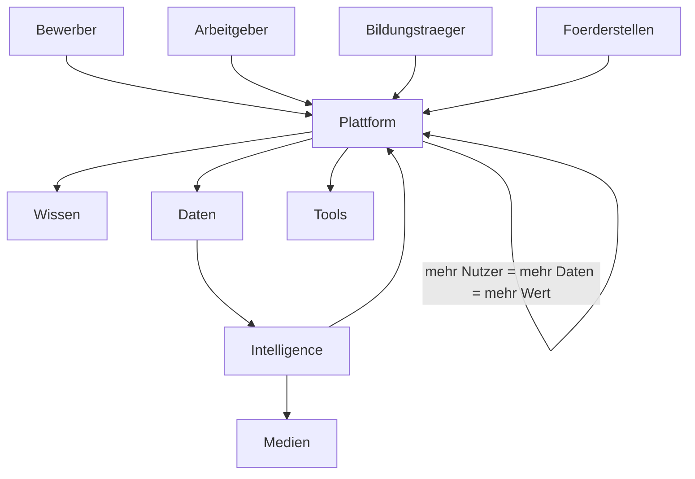
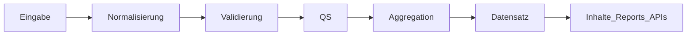
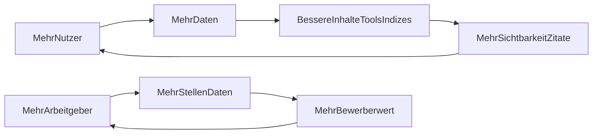
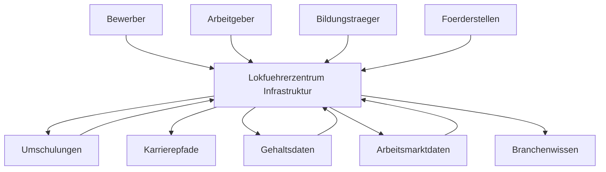

# Kapitel 08 — Dominanz-Layer: Community, UGC-Daten, Employer-Plattform, Intelligence, Ownership-Score, Netzwerkeffekt & Infrastruktur

> Erweiterung des Blueprints um die Layer, die aus einer Wissens-/Daten-Plattform eine
> **verteidigbare, sich selbst verstärkende Infrastruktur** machen. Kern dieses Kapitels:
> Burggraben (Moat), Netzwerkeffekt, Datenbesitz, Zitierbarkeit, langfristige Marktverteidigung.

> Priorisierungslinse dieses Kapitels (in Ergänzung zum [Scoring-Modell](README.md#4-scoring-modell-execution-engine)):
> **Impact · Moat · Netzwerkeffekt · Datenbesitz · Zitierbarkeit · langfristige Marktverteidigung.**

---

## 0. Der strategische Sprung: von Plattform zu Infrastruktur

Die Kapitel 01–07 bauen die beste **Wissens- und Datenquelle**. Dieses Kapitel macht daraus die
**zentrale Infrastruktur des deutschsprachigen Bahnarbeitsmarktes** — ein zweiseitiger
Marktplatz (Bewerber ↔ Arbeitgeber), gespeist aus nutzer- und arbeitgebergenerierten Daten,
der mit jedem Teilnehmer wertvoller wird.

**Warum verteidigbar:** Content ist kopierbar, ein gepflegtes zweiseitiges Datennetzwerk mit
exklusiven Bewertungs-, Gehalts- und Prozessdaten nicht. Der Burggraben ist der **Datenfluss**,
nicht der Text.

---

## 1. Community Engine

### 1.1 Zweck
Strukturierte, moderierte Erfahrungs- und Bewertungsdaten erzeugen — gleichzeitig
Information-Gain-Quelle, Trust-Signal, Conversion-Treiber und Rohstoff für eigene Datensätze.

### 1.2 Bausteine
| Baustein | Inhalt | Datenwert | Trust-Wert |
|---|---|---|---|
| Arbeitgeberbewertungen | Schicht, Führung, Bezahlung, Einstieg | speist Arbeitgeber-Trust-Score | hoch |
| Umschulungsbewertungen | Anbieterqualität, Betreuung, Erfolg | speist Umschulungsatlas | hoch |
| Bildungsträgerbewertungen | AZAV-Träger, Didaktik, Vermittlung | speist Ausbildungsindex | hoch |
| Erfahrungsberichte | Quereinstieg, Alltag, Hürden | Information Gain + Retrieval | sehr hoch |
| Prüfungsberichte | TfV-Prüfung, med./psych. Eignung | speist Prüfungsindex | hoch |
| Karriereberichte | Aufstieg, Arbeitgeberwechsel | speist Karriereindex | mittel-hoch |

### 1.3 Moderationssystem
- Einreichung → automatische Vorprüfung (Spam/Toxizität/Plausibilität) → menschliche/redaktionelle
  Freigabe für sensible Kategorien (Gehalt, Gesundheit, Recht).
- Versionierung + Audit-Trail (anschlussfähig an das bestehende CRM-Audit-Logging-Muster).
- Klare Richtlinien (keine personenbezogenen Vorwürfe, Faktenbezug), Melde-/Einspruchsweg.

### 1.4 Vertrauenssystem
- Verifizierungsstufen (z. B. verifizierte Beschäftigung/Teilnahme) erhöhen Gewicht der Beiträge.
- Reputationsscore je Beitragender; gewichtete Aggregation (verifizierte Beiträge zählen mehr).
- Transparente Anzeige von Stichprobengröße und Verifizierungsgrad pro aggregiertem Wert.

### 1.5 Compliance
Aggregierte Anzeige mit k-Anonymität; keine identifizierenden Einzelangaben; Bewertungen
faktenbezogen und moderiert; konsistent mit den Trust-Regeln aus [Kapitel 05](05-trust-schema-geo-aeo-llmo.md).

---

## 2. User Generated Data Engine

### 2.1 Zweck
Die Community-Beiträge und Tool-Eingaben in **strukturierte, validierte Datensätze** verwandeln —
der Rohstoff des Datenmonopols ([Kapitel 04](04-daten-und-tools.md)) wird crowdsourced statt nur recherchiert.

### 2.2 Datenquellen (UGC)
| Quelle | Erfasst | Mündet in |
|---|---|---|
| Gehaltsmeldungen | Gehalt nach Region/Erfahrung/Verkehr/Arbeitgeber | Gehaltsatlas / Gehaltsindex |
| Arbeitgeberdaten | Schichtmodelle, Einstiegsbedingungen, Standorte | Arbeitgeberatlas / Arbeitgeberindex |
| Schichtmodelle | reale Dienstpläne/Rhythmen | Arbeitgeber-Trust-Score |
| Bewerbungsquoten | Bewerbung → Einladung → Zusage | Recruiting Report |
| Erfolgsquoten Umschulung | Abschluss-/Vermittlungsquoten je Anbieter | Umschulungsatlas / Ausbildungsindex |

### 2.3 Pipeline: Erfassung → Validierung → QS → Datensatz

- **Erfassung:** strukturierte Formulare (feste Felder, kein Freitext für Kernmetriken).
- **Validierung:** Pflichtfelder, Wertebereiche, Plausibilität gegen Tarif-/Marktbänder,
  Dublettenprüfung, optionale Verifizierung.
- **QS:** Ausreißerbereinigung, Mindeststichprobe je Segment, Reviewer für sensible Werte,
  dokumentierte Methodik je Datensatz.
- **Datensatzgenerierung:** versionierte Quartals-Snapshots; Stand + Stichprobengröße sichtbar.

### 2.4 Verteidigbarkeit
Je mehr Meldungen, desto granularer und aktueller die Datensätze — ein Vorsprung, den
Wettbewerber nur durch eigenes, gleich großes Netzwerk einholen könnten (Netzwerkeffekt, §6).

---

## 3. Employer Platform Engine

### 3.1 Zweck
Die zweite Marktseite aktivieren: Arbeitgeber werden von "Datenobjekten" zu aktiven Nutzern, die
Daten liefern, Stellen verwalten und Bewerber erhalten — finanziert die Plattform und vertieft den Moat.

### 3.2 Bausteine
| Baustein | Funktion | Anbindung an Bestand |
|---|---|---|
| Arbeitgeberportal | Self-Service-Zugang für EVU | neue rollenbasierte Oberfläche, RBAC wie im CRM |
| Recruiting-Dashboard | Pipeline-/Funnel-Sicht für Arbeitgeber | spiegelt CRM-Pipeline-Logik (`LeadStatus`) |
| Stellenverwaltung | Stellen anlegen/pflegen | `JobPosting`-Schema ([Kapitel 05](05-trust-schema-geo-aeo-llmo.md)) |
| Bewerbermanagement | qualifizierte Kandidaten managen | nutzt bestehende Lead-/Dokumentenobjekte |
| Arbeitgeberprofile | öffentliche, datengestützte Profile | speist Arbeitgeberatlas + Bewertungen |
| Arbeitgeber-Analytics | Marktbenchmarks (Gehalt/Bedarf/Region) | aus Intelligence-Layer (§4) |
| Arbeitgebervergleich | transparenter Wettbewerbsvergleich | Ranking-Methodik aus [Kapitel 04](04-daten-und-tools.md) |
| Arbeitgeber-Trust-Score | aggregierter Vertrauenswert | aus Community (§1) + UGC (§2) |

### 3.3 Trennung der Marktseiten
- **Bewerberseite:** bestehender Funnel (`/eligibility`, CRM, WhatsApp) bleibt unverändert.
- **Arbeitgeberseite:** eigener, abgesicherter Bereich (`/arbeitgeber-portal`), rollenbasiert.
- **Datenschutz/Fairness:** Arbeitgeber sehen nur eingewilligte, qualifizierte Kandidatensignale;
  Bewertungen bleiben neutral und moderiert (kein "Pay-to-Whitewash").

### 3.4 Monetarisierung (Burggraben-verträglich)
Stellenlistings, Premium-Profile, Analytics-/Benchmark-Zugang, perspektivisch Recruiting-Erfolgsmodelle.
Monetarisierung darf Neutralität der Daten/Bewertungen nie kompromittieren.

---

## 4. Industry Intelligence Engine

> Konsolidiert und erhebt die in [Kapitel 04](04-daten-und-tools.md) angelegten Indizes zu einem
> eigenständigen, kontinuierlich publizierenden **Intelligence-Layer** (Citation-/Medien-Maschine).

### 4.1 Index-Familie
| Index | Misst | Frequenz | Speist |
|---|---|---|---|
| Bahnarbeitsmarktindex | Bedarf/offene Stellen/Trend | monatlich | Reports, Medien, Arbeitgeber-Analytics |
| Gehaltsindex | Gehaltsentwicklung nach Segment | quartalsweise | Gehaltsatlas, PR |
| Fachkräftemangelindex | Engpass-Score Beruf×Region | quartalsweise | Reports, Medien |
| Arbeitgeberindex | Attraktivität/Stabilität EVU | halbjährlich | Arbeitgeberportal, Ranking |
| Regionalindex | regionale Markt-/Chancenlage | quartalsweise | Regional-Hubs, Tools |

### 4.2 Studienarchitektur
- Einheitliche Methodik-/Versionierungs-/Reviewer-Standards (eine Methodik-Vorlage je Index).
- Datierte, versionierte Veröffentlichungen mit `Dataset`/`Report`-Schema und Methodikseite.
- Quartals- und Jahresreports als wiederkehrende Flaggschiffe.

### 4.3 Medienstrategie
- Fester Publikationskalender (monatlich/quartalsweise/jährlich) → planbare Berichterstattung.
- Einbettbare Visualisierungen mit Quellenangabe (Backlink-/Citation-Anreiz).
- Verzahnung mit Digital PR ([Kapitel 06](06-conversion-digital-pr.md)) und Report Center
  ([Kapitel 07](07-prioritaeten-roi-roadmaps.md)).

---

## 5. Entity Ownership Score Engine

### 5.1 Zweck
Ein messbares Steuerungssystem: **Wie stark dominieren wir jede Entität?** Macht Fortschritt
quantifizierbar und priorisiert Investitionen datenbasiert.

### 5.2 Score-Definition
Pro Entität (aus [Kapitel 02](02-entitaeten-knowledge-graph.md)) werden sechs Abdeckungsgrade
auf 0–100 gemessen; gewichtet ergibt sich der **Entity Ownership Score (EOS)**.

| Dimension | Frage | Gewicht |
|---|---|---|
| Content-Abdeckung | Sind alle Intents abgedeckt (Information Gain)? | 0,20 |
| Daten-Abdeckung | Eigene exklusive Daten zur Entität vorhanden? | 0,22 |
| Tool-Abdeckung | Interaktiver Nutzwert vorhanden? | 0,12 |
| Trust-Abdeckung | Autor/Reviewer/Methodik/Quellen? | 0,16 |
| Conversion-Abdeckung | Sauberer Funnel-Übergang? | 0,12 |
| Retrieval-Abdeckung | In LLMs/Suche bevorzugt/zitiert? | 0,18 |

`EOS = Σ(Dimension × Gewicht)`.

### 5.3 Konkurrenzvergleich & Lückenanalyse
- Je Entität wird der eigene EOS dem besten Wettbewerber gegenübergestellt (Delta = Angriffsfläche).
- Lückenanalyse identifiziert die schwächste Dimension je Top-Entität → konkrete Maßnahme.
- Ergebnis fließt in die Prioritätenmatrix ([Kapitel 07](07-prioritaeten-roi-roadmaps.md)).

### 5.4 Priorisierungssystem
Investiere zuerst dort, wo (hoher Markt-/Conversion-Wert) × (großes EOS-Delta) × (niedriger Aufwand)
am höchsten ist. Quartalsweise Neuberechnung; Verbindung zu den Retrieval-Audits aus
[Kapitel 05](05-trust-schema-geo-aeo-llmo.md).

---

## 6. Network Effect Engine

### 6.1 Prinzip
**Jede Aktion erzeugt Datenwert.** Die Plattform wird mit jedem zusätzlichen Nutzer/Arbeitgeber
wertvoller — der zentrale, kopierschützende Mechanismus.

| Aktion | Erzeugter Datenwert |
|---|---|
| Nutzeraktion (Tool/Suche/Beitrag) | Intent-/Nachfrage-/Erfahrungsdaten |
| Arbeitgeberaktion (Stelle/Profil/Daten) | Markt-/Bedarfs-/Konditionsdaten |
| Bewerbung | Quoten-/Funnel-/Erfolgsdaten |
| Bewertung | Trust-/Qualitätsdaten |
| Umschulung (Verlauf/Abschluss) | Erfolgsquoten-/Anbieterdaten |

### 6.2 Selbstverstärkende Schleife

### 6.3 Designregel
Jedes neue Feature wird gefragt: *Erhöht es den Datenwert pro zusätzlichem Teilnehmer?* Wenn nein,
ist es Beiwerk, kein Infrastruktur-Baustein.

---

## 7. Industry Infrastructure Engine (Zielzustand)

### 7.1 Ziel
Nicht die beste Website — die **zentrale Infrastruktur** des deutschsprachigen Bahnarbeitsmarktes.
Lokführerzentrum verbindet alle Akteure und Datenflüsse:

### 7.2 Verbundene Akteure & Flüsse
- **Bewerber** ↔ Wissen/Tools/Conversion ↔ **Arbeitgeber** (zweiseitiger Marktplatz)
- **Bildungsträger** ↔ Bewertungen/Erfolgsquoten ↔ **Förderstellen** (Bildungsgutschein-Prozess)
- **Datenflüsse:** Gehalts-, Arbeitsmarkt-, Erfolgs- und Prozessdaten zirkulieren und schärfen die Indizes.

### 7.3 Verteidigungsthese
Wer Wissen + zweiseitiges Netzwerk + exklusive Daten + Förderprozess-Nähe + kontinuierliche
Intelligence vereint, ist nicht durch ein einzelnes besseres Asset angreifbar — nur durch den
parallelen Aufbau **aller** Schichten gleichzeitig. Das ist der Burggraben.

---

## 8. Integration in den bestehenden Blueprint

| Layer (dieses Kapitel) | Wirkt auf bestehendes Kapitel |
|---|---|
| Community (§1) | Trust ([05](05-trust-schema-geo-aeo-llmo.md)), Daten ([04](04-daten-und-tools.md)) |
| UGC-Daten (§2) | Datenstrategie ([04](04-daten-und-tools.md)) |
| Employer-Plattform (§3) | Conversion/Marktplatz ([06](06-conversion-digital-pr.md)), Graph ([02](02-entitaeten-knowledge-graph.md)) |
| Intelligence (§4) | Daten ([04](04-daten-und-tools.md)), Digital PR ([06](06-conversion-digital-pr.md)) |
| Entity Ownership Score (§5) | Priorisierung ([07](07-prioritaeten-roi-roadmaps.md)), Retrieval ([05](05-trust-schema-geo-aeo-llmo.md)) |
| Network Effect (§6) | Conversion ([06](06-conversion-digital-pr.md)), Roadmap ([07](07-prioritaeten-roi-roadmaps.md)) |
| Infrastructure (§7) | Plattform-Zielbild ([07](07-prioritaeten-roi-roadmaps.md)) |

---

## 9. Umsetzung (PHASE 1–4)

**PHASE 1 — Fundament (Monat 0–3)**
- Entity-Ownership-Score-Modell definieren und für Top-50 Entitäten als Baseline berechnen.
- Erste UGC-Erfassung an bestehende Tools andocken (Gehaltsmeldung über Gehaltsrechner).
- Community-Datenmodell + Moderations-/Vertrauensregeln spezifizieren (noch read-light).

**PHASE 2 — Aktivierung (Monat 3–9)**
- Community-Bewertungen (Arbeitgeber/Umschulung/Bildungsträger) live + Moderationsworkflow.
- UGC-Data-Pipeline (Validierung/QS) produktiv; erste crowdsourced Datensatz-Updates.
- Intelligence-Layer: Arbeitsmarktindex monatlich, Gehaltsindex quartalsweise.

**PHASE 3 — Zweite Marktseite (Monat 9–18)**
- Arbeitgeberportal MVP (Profile, Stellenverwaltung, Basic-Analytics, Trust-Score).
- Netzwerkeffekt-Schleife messbar (Datenwert/Teilnehmer als KPI).
- EOS-gesteuerte Priorisierung quartalsweise institutionalisiert.

**PHASE 4 — Infrastruktur (Monat 18–36)**
- Vollausbau Arbeitgeber-Analytics/-Vergleich; Intelligence Center mit Jahresreports.
- Zweiseitiger Marktplatz als Standard-Infrastruktur; Daten-/B2B-Monetarisierung.
- Lokführerzentrum als zentrale Branchen-Infrastruktur etabliert und verteidigt.
